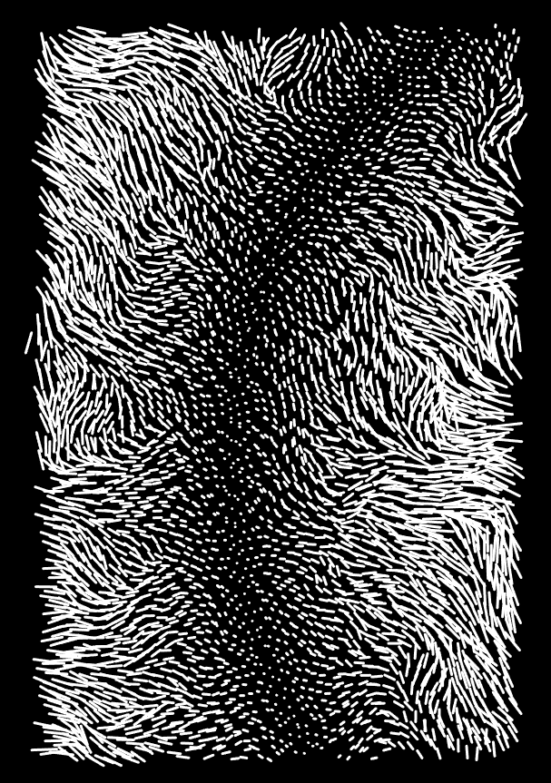
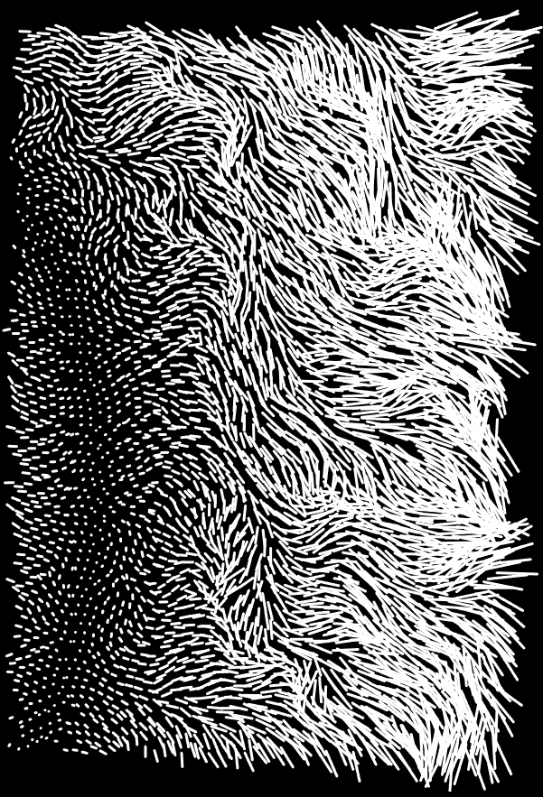
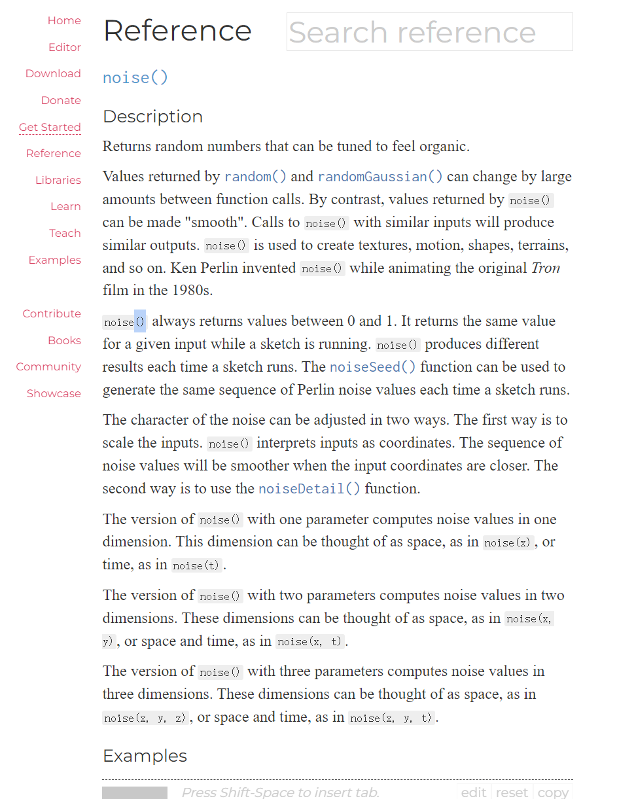

# jliu0024_9103_tut07

1. #**Imaging Technique Inspiration**  

The imaging technique I have chosen involves using a noise() function to generate dynamic visual textures. It can mimic natural phenomena or create fluid, smooth transitions in our assignment that require a dynamic visual background, thereby enhancing the visual complexity of the output. In terms of interaction,  mouse or keyboard inputs to respond to user interactions can significantly enhance realism and increase engagement. This method is particularly suitable for assignments that need visual dynamic elements or wish to interact with the background through user inputs.
[Artwork Sketch Link](https://openprocessing.org/sketch/2084145)

2. #**Coding Technique Exploration**  

The technique I employ involves using the noise() function ， this method uses Perlin Noise to dynamically manipulate visual elements and create flowing effects. The noise() function generates gradually changing values between calls, making the output not only random but also coherent, thus mimicking the seamless changes found in nature. This function can handle inputs in the form of coordinates, allowing for control over the scale and detail of the noise, which helps to achieve effects that simulate natural texture movements, such as flowing water or swaying underwater plants. This creates an interactive background that enhances my intended effects.

[The secondary page contains example code](https://openprocessing.org/sketch/2084145)  

[noise() introduction](https://p5js.org/reference/#/p5/noise)

